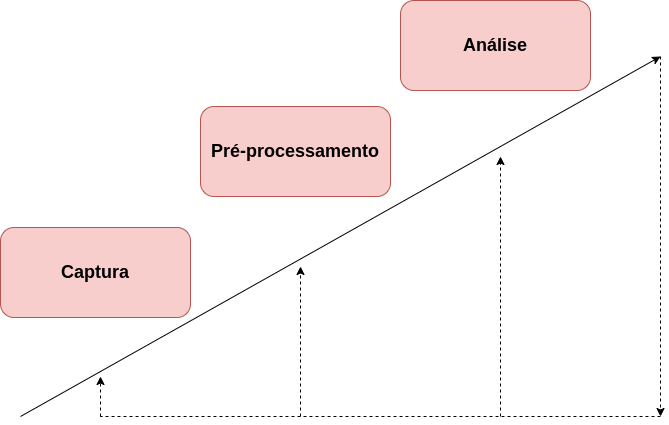
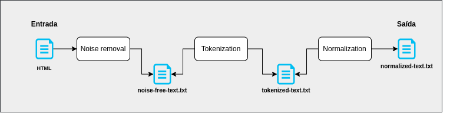

# Web Crawler and Text Analysis

O projeto tem o propósito de dar apoio técnico e prático para uma pesquisa de aplicação de algoritmos de análise textual com foco em identificação de 
paǵinas web duplicadas, fornecendo um ambiente de fácil interação e entendimento.

O projeto possui um Web Crawler para a captura de HTML's, e um diretório com os algoritmos de análise textual, juntamente com rotinas de pré-processamento de texto.

<p align="center"></p>

## Conteúdo

- [Quick Start](#quick-start)
- [Captura](#web-crawler)
- [Pré Processamento](#pre-process)
- [Análise](#text-analysis)
- [Contribuição](#contributing)
- [Contribuidores](#contributors)

## <a name="quick-start"></a>Quick Start

### Pré-requisitos

 - Instalar [Python 3](https://www.python.org/downloads/) e [pip](https://pip.pypa.io/en/stable/installing/) (gerenciador de pacotes do Python).
    - Verifique se estão instalados corretamente no sistema usando os seguintes comandos de terminal:
    
        ```bash
        $ python --version
        Python 3.7.1
        $ pip --version 
        pip 18.1 
        ```
 - Baixar o [geckodriver](https://github.com/mozilla/geckodriver/releases) (Driver do Firefox/Chrome para o Selenium).

### Instalando as bibliotecas

1. Faça download do código fonte ou clone o repositório;
2. Acesse a pasta do projeto;
3. Rode o comando `pip install -r requirements.txt` para instalar todas as dependências do projeto; 

### Configurando geckoriver
1. Com o [geckodriver](https://github.com/mozilla/geckodriver/releases) já baixado, coloque o arquivo em um diretório de sua escolha;
2. Salve o path do local do arquivo;
2. Acesse o arquivo [settings.py](settings.py) e acrescente o path do arquivo do geckodriver, conforme exemplo abaixo:
```bash
####################### SELENIUM #######################
GECKODRIVER = "/var/driver/geckodriver"
```

### Help

Para acessar os comandos de execução de cada etapa da aplicação, execute o comando abaixo na raiz do projeto:
```bash
$ python main.py help
```

## <a name="web-crawler"></a>Captura

### Executando Web Crawler

1. Acesse o arquivo [settings.py](settings.py) para acrescentar os links da web que deseja capturar o HTML;
```bash
####################### CRAWLING #######################
SITES = {'pronounced-dead-michigan': 'https://www.mlive.com/news/2020/08/pronounced-dead-michigan-woman-found-alive-at-funeral-home.html',
         'police-identify-northern': 'https://www.mlive.com/news/saginaw-bay-city/2020/08/police-identify-northern-michigan-woman-whose-burned-body-was-found-in-bay-county.html',
         'pirates-claim-former': 'https://www.mlive.com/tigers/2020/08/pirates-claim-former-tigers-pitcher-off-waivers.html',
         'tigers-cubs-lineup':  'https://www.mlive.com/tigers/2020/08/tigers-cubs-lineup-schoop-returns-candelario-remains-in-the-clean-up-spot.html'}
```
> **Note**: Os links desejados para captura são dispostos em um estrutura de dicionário (chave-valor) denominada SITES, onde a chave é o nome do arquivo em que o HTML vai ser salvo, e o valor é o link para a captura.
> Dentro desse arquivo [settings.py](settings.py) já contém alguns links públicos para utilização em testes. 

Ao fim, na raiz do projeto, execute o arquivo [main.py](main.py) com o seguinte comando:
```bash
$ python main.py crawler
```

O processo de crawling será iniciado e os HTML's serão salvos no diretório `htmls/` na raiz do projeto, que por sua vez, é criado automaticamente.
Para listar os htmls capturados, utilize o seguinte comando:
```bash
$ python main.py list-htmls
```

## <a name="pre-process"></a>Pré Processamento

O pré-processamento ou preparação dos dados é a primeira etapa do
processo de análise textual para a identificação de páginas web duplicadas, e
envolve a seleção dos dados que constituem a base de textos de interesse para
tentar selecionar o núcleo que melhor expressa o conteúdo destes textos.

<p align="center"></p>

Na raiz do projeto, execute o arquivo [main.py](main.py) com o seguinte argumento para iniciar o pré-processamento de um 
HTML:
```bash
$ python main.py preprocessing <filename_to_preprocess>
```

Para listar os HTMLs pré-processados, utilize o seguinte comando:
```bash
$ python main.py list-preprocessed-htmls
```

## <a name="text-analysis"></a>Análise

A etapa de Análise é a última etapa do processo de análise textual para a
identificação de páginas web duplicadas. Neste ponto, é realizado a aplicação de
algoritmos de análise de texto com o propósito de achar ocorrências de um
determinado padrão dentro de um texto.
A principal diferença entre os algoritmos são as suas diferentes maneiras de
implementação. Neste projeto são testados dois algoritmos diferentes: ​ Brute Force
e Rabin-Karp.

Para executar os algoritmos utilizando os arquivos preprocessados, na raiz do projeto, execute o arquivo [main.py](main.py) com o seguinte argumento:
```bash
$ python main.py brute-force-analyze <preprocessed_html_1> <preprocessed_html_2>
```
ou
```bash
$ python main.py rabin-karp-analyze <preprocessed_html_1> <preprocessed_html_2>
```

## <a name="contributing"></a>Contribuição

Sua ajuda é muito bem vinda!

> Dar uma estrela no GitHub é também uma maravilhosa maneira de mostrar seu apoio :star:

## <a name="contributors"></a>Contribuidores

 - **Fillipe Vieira** - fillipe.vieira2@gmail.com